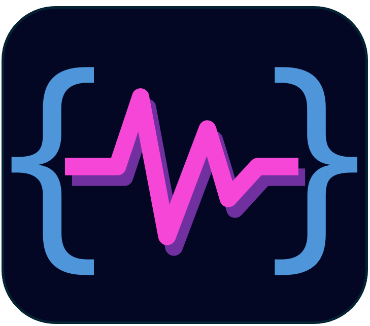

# VibeDash

A Flutter desktop dashboard for managing vibe project deployments across remote hosts.



## Problem this solves

If you're like me, thanks to ClaudeCode/Codex/OpenCode/Copilot, you can "develop" several applications at the same time.  While awesome, the task switching is problematic.

- I have 6 computers I remote into, plus my host machine.
- What is running in this computer / terminal?
- Oops... I typed the wrong command here. That was supposed to go in that Claude Code terminal.
- Oy. Thought something was running... its not.

## What it does

VibeDash gives you a single view of your vibe coding projects and the hosts they're deployed on. You can:

- **Track deployments** — assign projects to hosts with drag-and-drop
- **Connect to hosts** — click Connect to open a terminal running the host's connect command (e.g. `ssh user@host`)
- **Manage projects and hosts** — add, edit, and remove entries; state persists across sessions

Connect commands are shell-executed, not copied to clipboard. On Windows, console commands open a new PowerShell window; GUI executables (e.g. AutoHotkey) are launched directly. On macOS, Terminal.app opens. On Linux/WSL, the first available terminal emulator is used.

**NOTE:** Its not a process monitor. It cannot update the project to host assignments for you. Think of it as a project board where you can label which host is working on which project and easily swtich to that host.

## Platforms

| Platform | Status |
|----------|--------|
| Windows  | Supported |
| Linux    | Supported |
| macOS    | Supported (build from source) |

## Download

Pre-built binaries are available on the [Releases](https://github.com/mafudge/vibedash/releases) page.

## Build from source

**Prerequisites:** [Flutter SDK](https://docs.flutter.dev/get-started/install) (stable channel), desktop support enabled.

```bash
# Enable desktop (one-time)
flutter config --enable-windows-desktop  # or --enable-linux-desktop / --enable-macos-desktop

# Install dependencies
flutter pub get

# Run in debug mode
flutter run -d windows   # or -d linux / -d macos

# Build a release binary
flutter build windows --release
flutter build linux --release
flutter build macos --release
```

Windows output: `build\windows\x64\runner\Release\`  
Linux output: `build/linux/x64/release/bundle/`  
macOS output: `build/macos/Build/Products/Release/`

## State persistence

Dashboard state (projects, hosts, deployments) is saved to a JSON file in the platform's application support directory and loaded automatically on startup.

## Dependencies

- [`package_info_plus`](https://pub.dev/packages/package_info_plus) — reads the app version from `pubspec.yaml` at runtime
- [`process_run`](https://pub.dev/packages/process_run) — cross-platform process utilities for launching terminal commands
